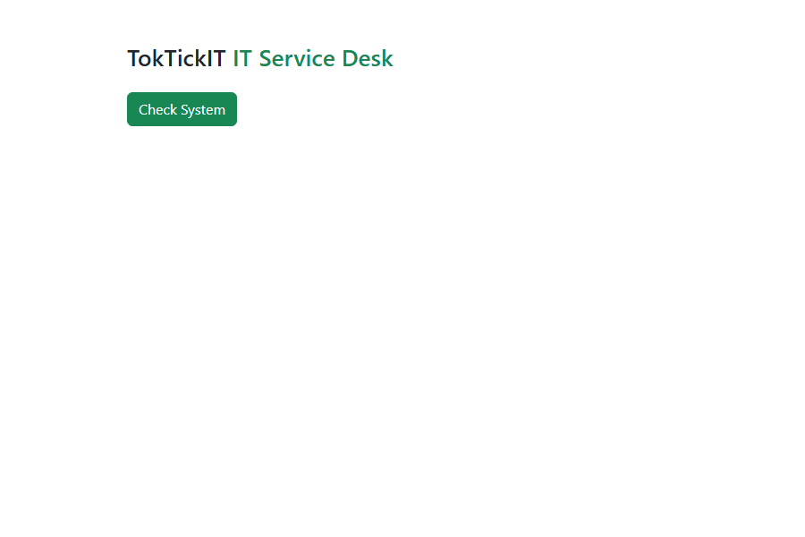
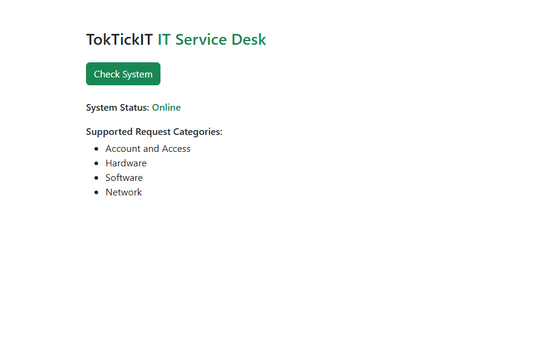
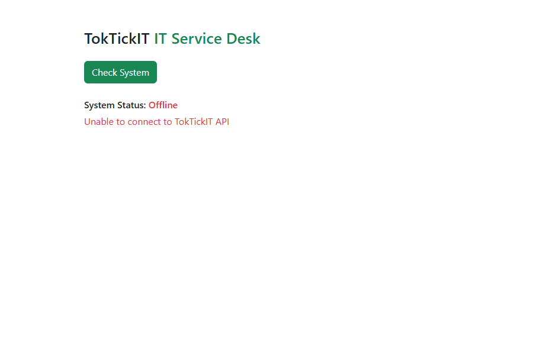

**CPE334 — Lab 1: TokTickIT Full-Stack Hello World Starter**
**Name:** Bannasorn Thongkorn | **Student ID:** 67070503420 | **GitHub:** @Punge089

---

# Answer Part 1: Git Use with Engineering Workflow

## URLs

| Item | URL |
|---|---|
| Repository | https://github.com/Punge089/toktickit |
| GitHub Project (Kanban) | https://github.com/users/Punge089/projects/2 |
| Issue 1 — Project Foundation | https://github.com/Punge089/toktickit/issues/1 |
| Issue 2 — API Health Check | https://github.com/Punge089/toktickit/issues/2 |
| Issue 3 — Category Model + Seed | https://github.com/Punge089/toktickit/issues/3 |
| Issue 4 — Category List | https://github.com/Punge089/toktickit/issues/4 |
| PR #5 — feature/1-project-foundation → lab1-staging | https://github.com/Punge089/toktickit/pull/5 |
| PR #6 — feature/2-health-check → lab1-staging | https://github.com/Punge089/toktickit/pull/6 |
| PR #7 — feature/3-category-seed → lab1-staging | https://github.com/Punge089/toktickit/pull/7 |
| PR #8 — feature/4-category-list → lab1-staging | https://github.com/Punge089/toktickit/pull/8 |
| PR #9 — docs fix → lab1-staging | https://github.com/Punge089/toktickit/pull/9 |
| PR #10 — Release: lab1-staging → main | https://github.com/Punge089/toktickit/pull/10 |
| PR #11 — docs (screenshots + report) → lab1-staging | https://github.com/Punge089/toktickit/pull/11 |
| PR #12 — Release: lab1-staging → main | https://github.com/Punge089/toktickit/pull/12 |

## GitHub Project — Kanban board

`[INSERT SCREENSHOT: Project board list view showing all 4 Issues as cards, and the board view with the 6-column Status field: Backlog, Specified, Started, PR Review, Fixing, Done]`

`[INSERT SCREENSHOT: Final board state — all 4 Issue cards sitting in the Done column]`

## Commit history — feature branches → lab1-staging → main

`[INSERT SCREENSHOT: terminal output of ` `git log --oneline --graph --all` ` run on the main branch, or the GitHub network/commits graph view, showing feature/1..4 merging into lab1-staging, and lab1-staging merging into main]`

Actual graph (captured via `git log --oneline --graph --all`):
```
*   e8e1089 Merge pull request #10 from Punge089/lab1-staging
|\
| *   fbcef92 Merge pull request #9 from Punge089/feature/Lab1Doc
| |\
| | * c7e9c27 docs: record PR #8 review exchange in reviewer.md
| |/
| *   ba657de Merge pull request #8 from Punge089/feature/4-category-list
| |\
| | * 84794a1 feat: display the IT request category list
| |/
| *   0c7423a Merge pull request #7 from Punge089/feature/3-category-seed
| |\
| | * aa8f00a feat: add Category model, initial migration, and idempotent seed
| * |   fa6b2ab Merge pull request #6 from Punge089/feature/2-health-check
| |\ \
| | |/
| |/|
| | * f91f366 feat: add /api/health endpoint and wire frontend Online/Offline states
| |/
| *   55cc713 Merge pull request #5 from Punge089/feature/1-project-foundation
|/|
| * 28e8919 docs: note that PostgreSQL must be running before prisma migrate dev
| * 4d2b303 feat: project foundation
|/
* efeb7c7 chore: initial TokTickIT scaffold
```

## Directory structure

`[INSERT SCREENSHOT: VS Code Explorer / IDE file tree of the repository root]`

```
toktickit/
├── client/               React + TypeScript + Vite + Bootstrap
│   ├── src/               App.tsx, api.ts, main.tsx
│   └── tests/lab-01/      App.test.tsx
├── server/               Express + TypeScript API
│   ├── prisma/            schema.prisma, seed.ts, migrations/
│   ├── src/                app.ts, index.ts, prisma.ts
│   └── tests/lab-01/       health.test.ts, categories.test.ts
├── docs/lab-01/           ai_use.md, reviewer.md, tests.md
├── .gitignore
└── README.md
```

## Rendered README.md

See [README.md](README.md) in the repository root — covers tech stack, prerequisites, setup steps
(clone → install → env → migrate/seed → run), required endpoints, and testing instructions.

## Rendered .gitignore

```
# dependencies
node_modules/
# env & secrets
.env
*.env
!.env.example
# build output
dist/
build/
# prisma
server/prisma/*.db
# logs & OS
*.log
.DS_Store
```

## PR Review Evidence

Rendered [docs/lab-01/reviewer.md](docs/lab-01/reviewer.md):

> **Author:** Bannasorn Thongkorn — 67070503420 — GitHub: @Punge089
> **Peer reviewer:** book6349 — GitHub: @book6349

All four feature PRs (#5–#8) received a real review comment from @book6349 and a direct reply
from me before I merged them, per the Aug 11, 2026 course clarification allowing comment +
self-merge for Lab 1. Example exchange (PR #7, Category Model + Seed):

> **@book6349:** "Ran the seed twice and no duplicates, nice. Does the category id order stay the
> same every time? Just thinking about Issue 4 needing to list them."
> **Me:** "Yeah, id is auto-increment so it won't change. But I'll still add orderBy: id
> explicitly in Issue 4 just to be safe, thank you for asking."

The full record of all four exchanges is in `docs/lab-01/reviewer.md`.

`[INSERT SCREENSHOT: GitHub PR conversation tab showing @book6349's comment and my reply, on at least one PR]`

**Reviewing my partner's PRs:** I reviewed and approved all four of @book6349's Issue PRs on
their own repo ([book6349/toktickit](https://github.com/book6349/toktickit)):
[#10](https://github.com/book6349/toktickit/pull/10),
[#11](https://github.com/book6349/toktickit/pull/11),
[#12](https://github.com/book6349/toktickit/pull/12),
[#13](https://github.com/book6349/toktickit/pull/13). Example (PR #12, Category Model + Seed):

> **Me:** "Reviewed Issue 3 database schema and seed script. The Category model definition
> adheres to requirements and the upsert logic guarantees idempotency without producing
> duplicate records. Looks great! Approved."
> **@book6349:** "Thank you for the review! Merging feature/3-category-seed into lab1-staging now."

Full record of all four exchanges is in `docs/lab-01/reviewer.md`.

`[INSERT SCREENSHOT: GitHub PR conversation tab on book6349/toktickit showing one of my review comments and their response]`

---

# Answer Part 2: Tests

## Terminal evidence — all tests passing on main

`[INSERT SCREENSHOT: terminal running ` `npm test` ` in server/, showing 2/2 passed]`
`[INSERT SCREENSHOT: terminal running ` `npm test` ` in client/, showing 3/3 passed]`

Captured output (server):
```
✓ tests/lab-01/health.test.ts (1 test) 19ms
✓ tests/lab-01/categories.test.ts (1 test) 95ms

Test Files  2 passed (2)
     Tests  2 passed (2)
```

Captured output (client):
```
✓ tests/lab-01/App.test.tsx (3 tests) 173ms

Test Files  1 passed (1)
     Tests  3 passed (3)
```

## Rendered docs/lab-01/tests.md

See [docs/lab-01/tests.md](docs/lab-01/tests.md):

| # | Test File | Tool | Test | Result |
|---|-----------|------|------|--------|
| API-01 | server/tests/lab-01/health.test.ts | Supertest | GET /api/health returns 200, status=ok | ✅ Pass |
| API-02 | server/tests/lab-01/categories.test.ts | Supertest | GET /api/categories returns 4 seeded categories in id order | ✅ Pass |
| UI-01 | client/tests/lab-01/App.test.tsx | Vitest | TokTickIT heading renders | ✅ Pass |
| UI-02 | client/tests/lab-01/App.test.tsx | Vitest | Loading state changes to Online + category list | ✅ Pass |
| UI-03 | client/tests/lab-01/App.test.tsx | Vitest | API failure displays Offline error message | ✅ Pass |

---

# Answer Part 3: AI Use and Reflection

Rendered [docs/lab-01/ai_use.md](docs/lab-01/ai_use.md):

**LLM/agent used:** Claude Code (Claude Sonnet 5), run from a VS Code-integrated terminal.

**Selected key prompts:** see the full table in `docs/lab-01/ai_use.md` — covers the initial
planning prompt, the peer-reviewer/repo/DB setup decisions, "what should be my friend review?",
"is my friend's review going to affect my score?", drafting real review comments, and the final
"gogo" merge confirmations.

**Reflection:** The plan-first approach caught a branch-sequencing mistake early (feature
branches must branch from `lab1-staging`, not `main`, per the labsheet's own git graph). I had
to actively push the agent to verify real GitHub state (via `gh pr view`) rather than trusting my
word that a review was "done" before merging, and I had to remember myself that the
bidirectional peer-review requirement means reviewing my partner's *own* repo, which is outside
what the agent could do inside my repo.

---

# Answer Part 4: App Demo

Captured live with the full stack running (Playwright-driven headless Chromium against the real
Vite dev server and Express API, backed by the seeded PostgreSQL database).

**Idle state** — `docs/lab-01/screenshots/app-demo-1-idle.png`



**Success state** (after clicking Check System) — `docs/lab-01/screenshots/app-demo-2-success.png`



**Offline state** (server stopped, then Check System clicked again) — `docs/lab-01/screenshots/app-demo-3-offline.png`



Verified manually via curl before the UI screenshots:
```
GET /api/health      -> {"status":"ok","service":"TokTickIT API"}
GET /api/categories  -> [{"id":1,"name":"Account and Access"},{"id":2,"name":"Hardware"},
                          {"id":3,"name":"Software"},{"id":4,"name":"Network"}]
```
